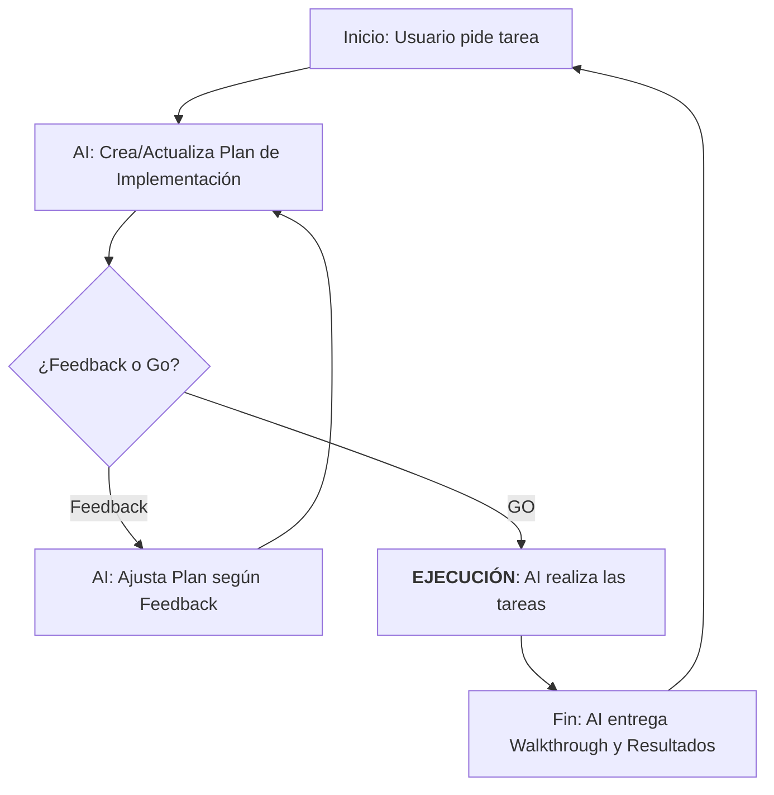

# Protocolo de Lógica de Trabajo: Antigravity ↔ USER

Este documento define el acuerdo de interacción para asegurar transparencia, control total del usuario y eficiencia en las tareas.

## 🔄 Ciclo de Trabajo Estándar

1.  **Requerimiento**: El Usuario solicita una tarea específica.
2.  **Propuesta**: Antigravity genera un `implementation_plan.md` detallado y espera instrucciones.
3.  **Iteración**:
    *   Si el Usuario da **Feedback**, Antigravity ajusta la propuesta y la vuelve a presentar.
    *   Si el Usuario da el **"GO"** (Ej: "Go", "Procede", "Adelante"), Antigravity inicia la ejecución.
4.  **Ejecución**: Antigravity realiza las tareas prometidas y confirma el avance.

> [!IMPORTANT]
> **Regla de Oro**: Antigravity tiene PROHIBIDO ejecutar cualquier cambio en el código o archivos del sistema sin antes haber recibido un "GO" explícito del Usuario sobre la propuesta vigente.

---

## 🛠️ Mejoras Propuestas (Para tu revisión)

Para hacer esta lógica más robusta, propongo añadir:

*   **Señales de GO Claras**: Utilizar palabras clave como `GO`, `PROCEDE` o `ADELANTE` para evitar ambigüedades.
*   **Puntos de Control (Checkpoints)**: En tareas muy largas (>15 min), haré una pausa después de cada módulo principal para pedir un nuevo "Go" antes de seguir.
*   **Gestión de Errores**: Si durante un "Go" encuentro un error técnico menor (ej: un typo), lo corregiré automáticamente; pero si el error requiere cambiar la lógica, me detendré y pediré feedback.
*   **Visibilidad de Estado**: Siempre mantendré actualizado el archivo `task.md` y el `Task View` superior para que sepas exactamente en qué punto del "Go" me encuentro.

---
## 📊 Diagrama de Flujo (WL)

---
*Ultima actualización: 2026-01-21*
