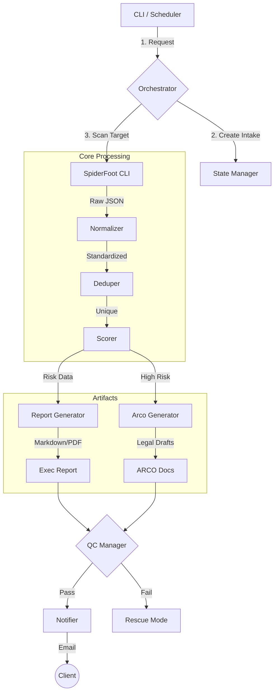

# MAPA-RD OSINT Automation Pipeline

> **"SpiderFoot descubre. MAPA-RD decide."**

System for automated, passive OSINT analysis, risk scoring, and legal action generation (ARCO).

## Directory Structure
- `07_Src/`: Core Python modules (Orchestrator, Normalizer, Scorer, etc.)
- `03_Config/`: Configuration files (`scan_profile.json`, `scoring_rules_v1.json`)
- `08_Templates/`: Templates for reports and legal documents (`arco_mx_template.md`, `report_executive.md`)
- `04_Data/`: Data storage
    - `intake/`: Client input JSONs
    - `raw/`: SpiderFoot raw output
    - `normalized/`: Processed findings
    - `reports/`: Final executive reports
    - `arco/`: Generated legal drafts

## Prerequisities
- Python 3.8+
- SpiderFoot (installed and accessible via CLI/API)
- Pandoc & LaTeX (for PDF generation)

## 🏗️ Architecture



## Usage

### 1. Create a Client Intake
Create a JSON file in `data/intake/{client_id}.json`:
```json
{
  "client_id": "example-client",
  "identity": {
    "names": ["Full Name"],
    "emails": ["email@example.com"],
    "domains": ["example.com"]
  },
  "jurisdiction": "MX"
}
```

### 2. Run the Pipeline
(Currently available via the `orchestrator.py` script or the `tests/test_pipeline.py` example).

```bash
python src/orchestrator.py
```


## Configuration
- **Scan Profile**: Modify `config/scan_profile.json` to enable/disable specific SpiderFoot modules.
- **Scoring Rules**: Adjust risk logic in `config/scoring_rules_v1.json`.

## PDF Generation
The pipeline attempts to automatically generate a PDF version of the Executive Report using **Pandoc**.

### Automatic Installation
- **Windows**:
    - **Pandoc**: MSI silent install.
    - **LaTeX**: If missing, downloads and installs **MiKTeX Basic** (Silent, Current User).
- **Linux/macOS**: Attempts to install via `apt-get` or `brew`.

### Troubleshooting
If PDF generation fails, check:
1.  **Pandoc**: Ensure `pandoc` is in your system PATH.
2.  **LaTeX Engine**: 
    - The pipeline attempts to install MiKTeX automatically on Windows.
    - If it fails (e.g., firewall, permission issues), install [MiKTeX](https://miktex.org/) manually.
    - **Note**: A system restart or shell refresh might be needed after installation.

**Note**: If PDF generation fails, the pipeline **will not stop**. The `.md` report is always preserved as the source of truth.

## Legal Disclaimer
This tool mimics passive OSINT collection. Ensure you have authorization before scanning targets. The generated ARCO documents are drafts and should be reviewed by legal counsel.
